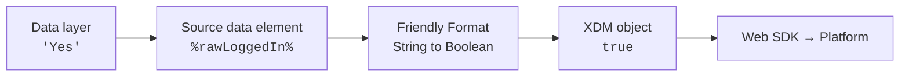

<div align="center">


**Type conversion data elements for Adobe Experience Platform Data Collection**

Turn the strings in your data layer into the Booleans, integers, and doubles
that XDM actually expects — in the Tags runtime, before the data ever leaves
the page.

[](https://experienceleague.adobe.com/en/docs/experience-platform/tags/extension-dev/overview)
[](CHANGELOG.md)
[](LICENSE)
[](https://opensource.adobe.com/coral-spectrum/)
[](#design-notes)

</div>

---

## The problem

Data layers are often stringly typed, or Launch when using default values / extensions often changes types to be “string”. XDM is not depending on your schema field groups; A schema field declared as a Boolean rejects `"true"`, a `measure` field expecting a double rejects `"$1,234.56"`, and an empty string sent to an integer field fails validation outright. 
The usual workaround is a one-off custom code data element per field, each with its own quietly different opinion about what `""`, `null`, and `"maybe"` should mean that you then have to extrapolate across each of your data elements in custom code.

Friendly Format replaces those snippets with three configurable data element types.

| Data layer value | Sent without conversion | Sent with Friendly Format |
| --- | --- | --- |
| `"Yes"` | `"Yes"` — rejected by a Boolean field | `true` |
| `"$1,234.56"` | `"$1,234.56"` — rejected by a measure field | `1234.56` |
| `"2.6"` | `"2.6"` — rejected by an integer field | `3` |
| `""` | `""` — rejected, or stored as an empty string | field omitted, or `null`, your choice |
| `null` | inconsistent, depending on the source | your choice, set explicitly |



---

## Contents

- [Data element types](#data-element-types)
  - [String to Boolean](#string-to-boolean)
  - [String to Integer](#string-to-integer)
  - [String to Double](#string-to-double)
- [Edge cases and the Default Value trap](#edge-cases-and-the-default-value-trap)
- [Installation](#installation)
- [Walkthrough](#walkthrough)
- [Local development](#local-development)
- [Project layout](#project-layout)
- [Packaging and submission](#packaging-and-submission)
- [Design notes](#design-notes)
- [Contributing](#contributing)
- [License](#license)

---

## Data element types

All three types share the same shape: a **Value to convert** field — normally a
data element token such as `%rawLoggedIn%`, inserted with the standard data
element picker next to the field — plus parsing options and three explicit
edge-case settings. The views are built with [Coral Spectrum](https://opensource.adobe.com/coral-spectrum/), so they look and
behave like the rest of the Data Collection UI. Full reference: [`docs/data-element-types.md`](docs/data-element-types.md).

### String to Boolean

Matches the input against a list of true values and a list of false values.

| Setting | Default |
| --- | --- |
| Values treated as true | `true, yes, y, 1, on, t` |
| Values treated as false | `false, no, n, 0, off, f` |
| Trim surrounding whitespace | on |
| Match case sensitively | off |
| When the value matches neither list | return nothing (undefined) |
| When the value is empty or only whitespace | return nothing (undefined) |
| When the value is null or undefined | return nothing (undefined) |

```text
"Yes"      → true          "off"    → false
"  TRUE  " → true          "0"      → false
"maybe"    → your choice: truthiness, true, false, null, or unset
```

Both lists are tag fields, pre-filled with the defaults: type a value and press
**Tab**, Enter, or comma to add it, and select the **X** on a tag to remove it.
*Restore defaults* refills a list, so `Enabled` / `Disabled` or `Y` / `N` are as
easy to set up as the defaults are to keep. **Truthiness conversion** handles "treat anything that is not explicitly false as true": it judges numeric strings numerically, so `"2"` is
`true` while `"0.0"` and `"-0"` are `false`, and everything else non-empty is
`true`. A value that is already a Boolean passes through untouched.

### String to Integer

Parses a number, then reduces it to a whole number.

| Setting | Default |
| --- | --- |
| Trim surrounding whitespace | on |
| Strip non-numeric characters | off |
| Require the whole value to be numeric | on |
| When the value has a decimal part | round |
| When the value cannot be parsed | return nothing (undefined) |
| When the value is empty or only whitespace | return nothing (undefined) |
| When the value is null or undefined | return nothing (undefined) |

```text
"42"      → 42            "-12.6" → -13   (round)
"$1,234"  → 1234          "-12.6" → -12   (truncate)
"12abc"   → invalid, or 12 with the whole-value requirement off
```

Decimal input can be rounded, truncated toward zero, rounded down, rounded up,
or rejected as invalid.

### String to Double

Parses a number and optionally rounds it to a fixed number of decimal places.

| Setting | Default |
| --- | --- |
| Trim surrounding whitespace | on |
| Strip non-numeric characters | off |
| Require the whole value to be numeric | on |
| Decimal separator | period |
| Decimal places | unset, full precision |
| When the value cannot be parsed | return nothing (undefined) |
| When the value is empty or only whitespace | return nothing (undefined) |
| When the value is null or undefined | return nothing (undefined) |

```text
"19.99"      → 19.99      "1.234,56" → 1234.56  (comma notation)
".5"         → 0.5        "€1.234,56" → 1234.56 (comma + stripping)
"19.9876"    → 19.99      (2 decimal places)
```

---

## Edge cases and the Default Value trap

Every type answers three questions explicitly, rather than guessing:

| Input | Setting | Options |
| --- | --- | --- |
| `null` or `undefined` | *When the value is null or undefined* | leave unset · `null` · a typed fallback |
| `""` or `"   "` | *When the value is empty or only whitespace* | leave unset · `null` · a typed fallback |
| `"maybe"`, `"abc"` | *When the value cannot be interpreted* | leave unset · `null` · a typed fallback |

> [!WARNING]
> **Leave the data element's Default Value field empty.**
>
> Tags swaps a data element's result for its **Default Value** whenever that
> result is `null` or `undefined`. The field is free text, so what comes back is
> a **string** — and a Default Value that is merely *blank* still counts:
>
> | Default Value | Result of a `null`/`undefined` conversion |
> | --- | --- |
> | empty | `undefined`, field omitted ✅ |
> | blank but saved | `""` — a string ❌ |
> | `false` | `"false"` — a string ❌ |
> | `0` | `"0"` — a string ❌ |
>
> Set the fallback with the edge-case settings above instead, where it keeps its
> type.
>
> **Clean text** and **Force lowercase** do *not* stringify a typed result —
> Turbine guards both with `typeof value === 'string'`, so a Boolean or number
> passes through untouched. Leave them off anyway: the only value they can reach
> here is a string a Default Value substituted in.

Choose deliberately between the two clean outcomes:

- **`null`** — the field is sent with a null value, which **clears** it in
  Platform if working with a merged schema data element. Choose *Return null* and leave Default Value empty.
- **`undefined`** — the field is **omitted** from the payload, leaving any
  existing profile value untouched. Choose *Return nothing (undefined)* and
  leave Default Value empty.

This warning is repeated inside each data element view, next to the settings it
affects.

---

## Installation

Once the extension is published to the Data Collection catalog:

1. In the Data Collection UI, open your property and go to **Extensions →
   Catalog**.
2. Find **Friendly Format** and select **Install**.
3. Create a data element, choose **Friendly Format** as the extension, then pick
   **String to Boolean**, **String to Integer**, or **String to Double**.

To try it before publication, upload the package to your own organization —
see [Packaging and submission](#packaging-and-submission).

---

## Walkthrough

Converting a `"Yes"` / `"No"` login flag into a real Boolean:

1. **Create the source data element.** Any type that reads your raw string — a
   JavaScript variable pointing at `digitalData.user.loggedIn`, for example.
   Name it `rawLoggedIn`.
2. **Create the converted data element.** Extension **Friendly Format**, type
   **String to Boolean**, name it `loggedIn`.
3. **Set the value to convert.** Select *Add data element*, pick `rawLoggedIn`,
   which inserts `%rawLoggedIn%`.
4. **Decide the edge cases.** For a login flag, "not logged in unless told
   otherwise" is usually right: set empty and null to **Return false**, and
   leave unmatched values on **Return nothing (undefined)** so a
   surprise value shows up as missing rather than as a confident `false`.
5. **Leave Default Value empty.** See the warning above.
6. **Map it.** In your XDM object, map `%loggedIn%` to the Boolean field.

Verify in the browser console before publishing:

```js
_satellite.getVar('loggedIn');          // true
typeof _satellite.getVar('loggedIn');   // "boolean", not "string"
```

### When a data element returns `undefined`

`undefined` is a real result here, not a failure: it is what **Return nothing
(omit)** asks for, and it is the default for unmatched, empty, and null. So a
field you meant to omit and a source value that never arrived look exactly the
same from the outside.

Turn on logging and re-resolve the data element, and each type will say which
path it took:

```js
_satellite.setDebug(true);
_satellite.getVar('loggedIn');
```

```
String to Boolean: "loggedIn" is in neither the true nor the false list;
unmatchedBehavior "omit" returned undefined. The field is left out of the payload.
```

Values dropped by a fallback setting log at `warn`; successful conversions log at
`debug`. The message above is the most common configuration mistake: a data
element *name* in the source field instead of a `%token%`. It passes validation,
since any non-empty text is allowed, then matches nothing at runtime. Use the
data element icon beside the field to insert `%loggedIn%` rather than typing the
name.

---

## Local development

```bash
npm install       # also copies Coral Spectrum into src/view/coral
npm test          # unit tests for the library modules (node:test, no browser needed)
npm run validate  # reactor-validator: checks extension.json against the manifest schema
npm run vendor    # refreshes the vendored Coral Spectrum on demand
npm run sandbox   # serves views at https://localhost:4000
```

With the sandbox running:

- **Views** — open <https://localhost:4000> and pick a data element type to
  exercise the configuration UI, including validation and saved settings.
- **Runtime** — open <https://localhost:4000/libSandbox.html> and evaluate the
  sample data elements defined in [`.sandbox/container.js`](.sandbox/container.js):

  ```js
  localStorage.setItem('loggedIn', 'Yes');
  localStorage.setItem('cartQuantity', '2.6');
  localStorage.setItem('orderTotal', '$1,234.567');

  _satellite.getVar('loggedIn');     // true
  _satellite.getVar('cartQuantity'); // 3
  _satellite.getVar('orderTotal');   // 1234.57
  ```

The sandbox serves over a self-signed certificate, so accept the browser warning
the first time.

---

## Project layout

```
extension.json                  Manifest: the three data element types and their setting schemas
src/lib/dataElements/           Runtime library modules, one per type (CommonJS, ES5)
src/lib/helpers/                Shared edge-case logic, numeric parsing, and the enum constants
src/view/dataElements/          Configuration views shown in the Tags UI
src/view/scripts|styles/        Shared view helpers and layout
src/view/coral/                 Coral Spectrum runtime, built at package time (not committed)
scripts/vendor-coral.js         Copies Coral Spectrum in, trimming its icon sprite to what the views use
resources/icons/                Extension icon shown in the Tags catalog
docs/assets/                    Project logo used by this README
tests/                          Unit tests, plus a manifest/constants/views consistency check
docs/                           Option reference, submission checklist, UI framework assessment
.sandbox/container.js           Sample data elements for local sandbox testing
```

Everything under `src/view` stays exactly one directory deep. That is a hosting
constraint, not a style preference: Adobe drops more deeply nested paths when it
serves an uploaded package, and neither the sandbox nor `reactor-validator`
catches it — `tests/viewAssets.test.js` does. See
[docs/submission.md](docs/submission.md#view-assets-have-to-stay-one-directory-deep).

The views load Coral Spectrum from the package itself rather than a CDN, so
`src/view/coral` has to exist before the sandbox, the tests, or the
packager run. `npm install`, `npm test`, `npm run sandbox`, and `npm run package`
each refresh it automatically; `npm run vendor` does it on demand. The output is
not committed.

Coral's workflow icon sprite is not copied verbatim: it ships close to two
thousand icons and the views reference one, so the sprite is rebuilt from the
`icon="…"` attributes found in `src/view`. That is 45% of the packaged size.
`tests/icons.test.js` checks the sprite and the views against each other in both
directions, so an icon added to a view cannot silently render as a blank.

---

## Packaging and submission

```bash
npm run package   # builds package-andylunsford-friendly-format-<version>.zip
npm run upload    # uploads the zip using Adobe OAuth Server-to-Server credentials
npm run release   # moves the uploaded version from development to private
```

[`docs/submission.md`](docs/submission.md) walks through the full Adobe
[submission path](https://experienceleague.adobe.com/en/docs/experience-platform/tags/extension-dev/submit/overview)
— org setup, permissions, Exchange listing, upload, and release — and tracks
what still needs a real value before submission: the Exchange URL, author
contact, and the placeholder icon.

---

## Design notes

- **No runtime dependencies.** The library modules are plain ES5 CommonJS,
  adding a few kilobytes to the Tags library. Coral Spectrum ships in the
  package for the views only, so nothing about the design system reaches the
  pages your tags run on.
- **Self-contained views.** Coral is vendored rather than loaded from a CDN, and
  the views are plain HTML custom elements with no bundler, so what you read in
  `src/view` is exactly what ships.
- **Why Coral Spectrum.** Adobe's guidance names three reasonable UI choices:
  React Spectrum (the official framework for the Tags UI, and what
  [reactor-extension-core](https://github.com/adobe/reactor-extension-core) uses
  today), Spectrum CSS with vanilla JavaScript, or a plain framework of your
  own. React is aimed at UIs that re-render in response to state, which these
  stateless forms do not; Spectrum CSS is styling only, leaving the tag entry
  and dropdown behavior to write by hand. Coral Spectrum sits between them —
  Spectrum-styled components that behave on their own, with no build step. The
  trade is package size and an older Spectrum generation. Migrating to React
  Spectrum is the move if the views ever grow stateful —
  [`docs/ui-framework.md`](docs/ui-framework.md) has the measured sizes and what
  each alternative would cost.
- **One source of truth for enums.** Every value the manifest restricts is named
  in [`src/lib/helpers/constants.js`](src/lib/helpers/constants.js), and
  [`tests/manifest.test.js`](tests/manifest.test.js) checks the manifest, the
  constants, and the options the views offer against each other, so the copies
  cannot drift apart.
- **Conversion happens once, in the runtime.** Downstream rules, actions, and
  XDM mappings all read the already-typed value.
- **Nothing is guessed silently.** Every ambiguous input has a setting, and the
  default for all of them is to leave the value unset rather than invent one.
- **Known limits.** Stripping non-numeric characters also strips exponent
  notation, and integers beyond `Number.MAX_SAFE_INTEGER` lose precision as they
  do anywhere in JavaScript. Both are documented in
  [`docs/data-element-types.md`](docs/data-element-types.md#caveats).

---

## Contributing

Issues and pull requests are welcome at
<https://github.com/andylunsford/FriendlyFormat>. Please run `npm test` and
`npm run validate` before opening a pull request, and add unit tests for any new
conversion behavior. Changes to the runtime modules should stay ES5 and
dependency free, views should use Coral Spectrum components rather than custom
controls, and `src/view/coral/` should never be committed.

---

## License

Apache-2.0. See [LICENSE](LICENSE).
